# Endpoint Telemetry Generation, Ingestion, and Source Endpoint Identification in Wazuh SIEM

**Source Endpoint:** Windows 11 Enterprise / Pro (GAL1LEO / Agent Name: `Windows_11` / Agent ID: `002`)

**SIEM Manager:** Wazuh Manager (192.168.6.133)

**Date of Execution:** September 22, 2026

---

## 1. Executive Summary & Objective

The primary objective of this lab exercise is to simulate safe, permitted endpoint activities — including authentication attempts, process executions, service state modifications, and user account creation — on a Windows endpoint, verify that the resulting telemetry successfully streams to the centralized Wazuh SIEM Manager, and conclusively identify the source endpoint responsible for the activity.

Across 19 collected telemetry screenshots from the Wazuh Dashboard , I verified that 53 distinct security events were ingested from the primary endpoint identified as GAL1LEO (Agent ID: 002, Agent Name: Windows_11, IP: 192.168.6.1).

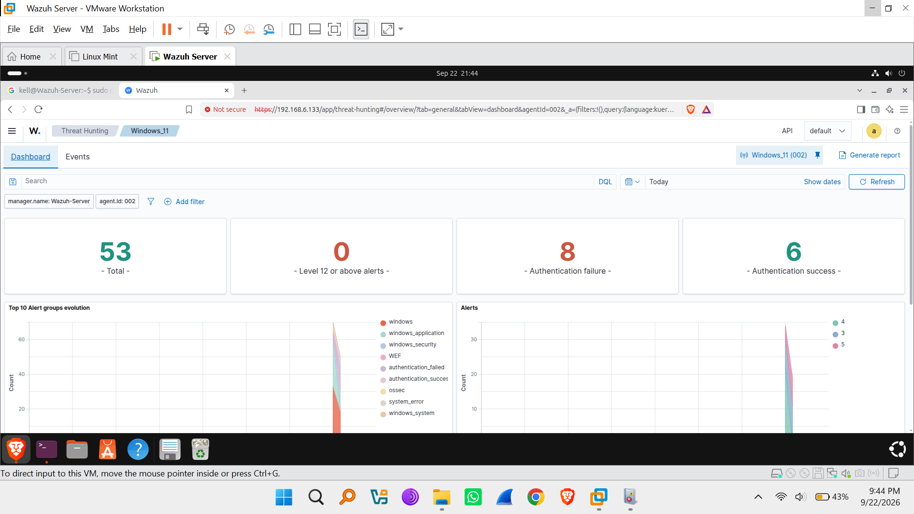
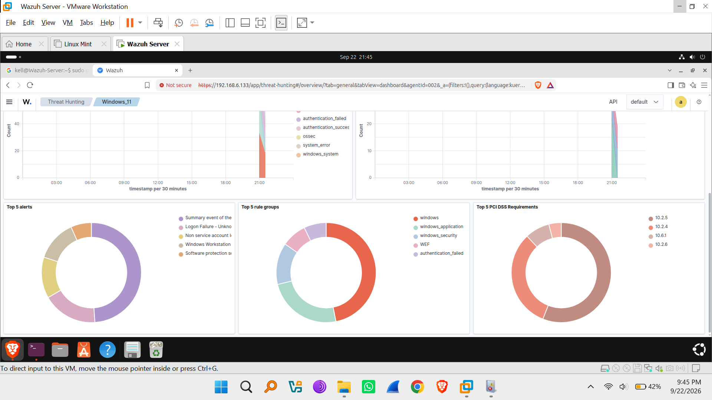

---

## 2. Environment Configuration & Source Endpoint Identification

### 2.1 Endpoint Identification

To ensure accurate threat attribution in a SOC context, all ingested logs were checked for source host metadata. The primary source endpoint was identified as follows:

| Telemetry Variable | Extracted Value |
|---|---|
| Agent ID | 002 |
| Agent Name | Windows_11 |
| Agent IP Address | 192.168.6.1 |
| Host System Computer Name (`data.win.system.computer`) | GAL1LEO |
| Wazuh Manager IP | 192.168.6.133 |
| Operating System | Microsoft Windows 11 Pro (10.0.26200.9457) |

---

## 3. Simulated Endpoint Activities & Ingested Telemetry Verification

### 3.1 Activity Category 1: Authentication Attempts

#### A. Failed Authentication Attempts (Logon Failures)

- **Simulation Action:** Repeated incorrect credential entries were initiated on host GAL1LEO.
- **Ingested Telemetry & Verification:**
  - **Event Count:** 8 Authentication Failure events recorded.
  - **Wazuh Rule ID:** `60122` (Logon Failure - Unknown user or bad password).
  - **Rule Severity Level:** Level 5 (Medium).
  - **Windows Event ID:** `4625` (An account failed to log on).
  - **Channel / Provider:** Security / Microsoft-Windows-Security-Auditing.
  - **Target Workstation / Target User:** GAL1LEO.
  - **Logon Type:** Type 2 (Interactive Logon).
  - **Authentication Package / Process:** Negotiate / `C:\Windows\System32\svchost.exe`.
  - **Regulatory Compliance Mapping:** PCI DSS 10.2.4, 10.2.5 | NIST 800-53 AU.14, AC.7.

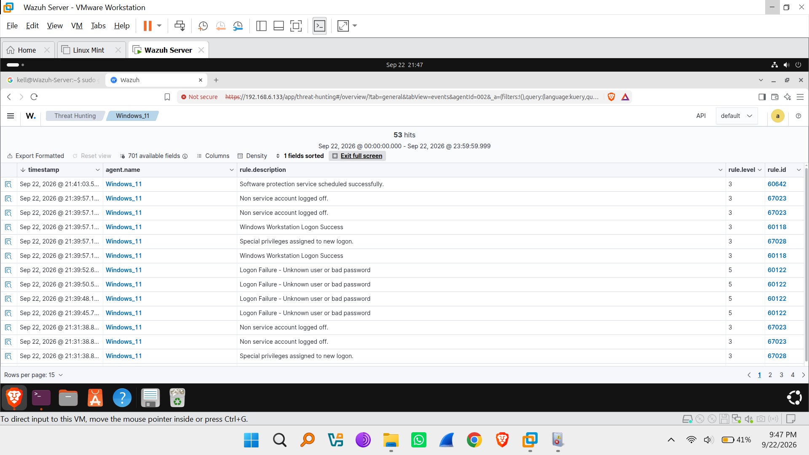

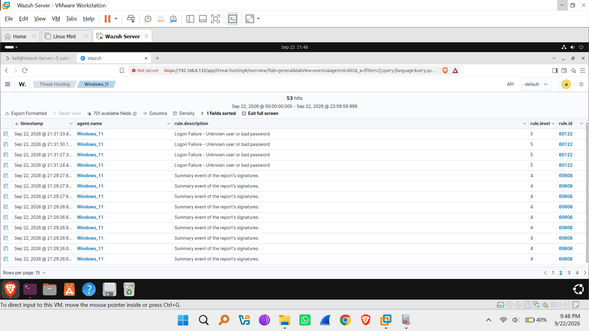

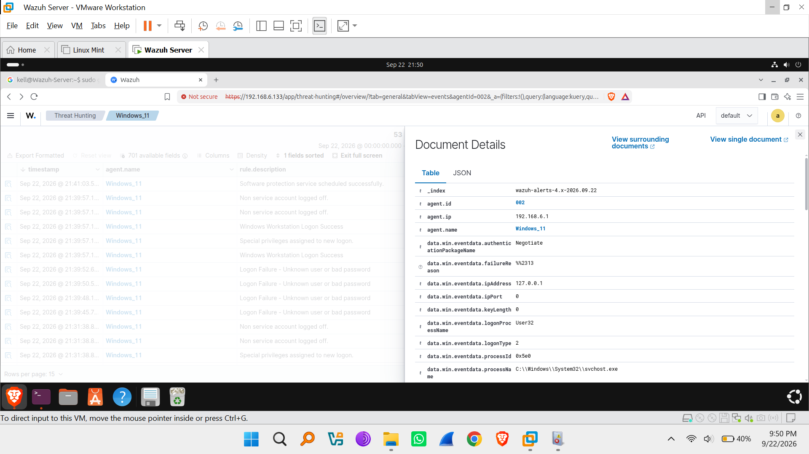

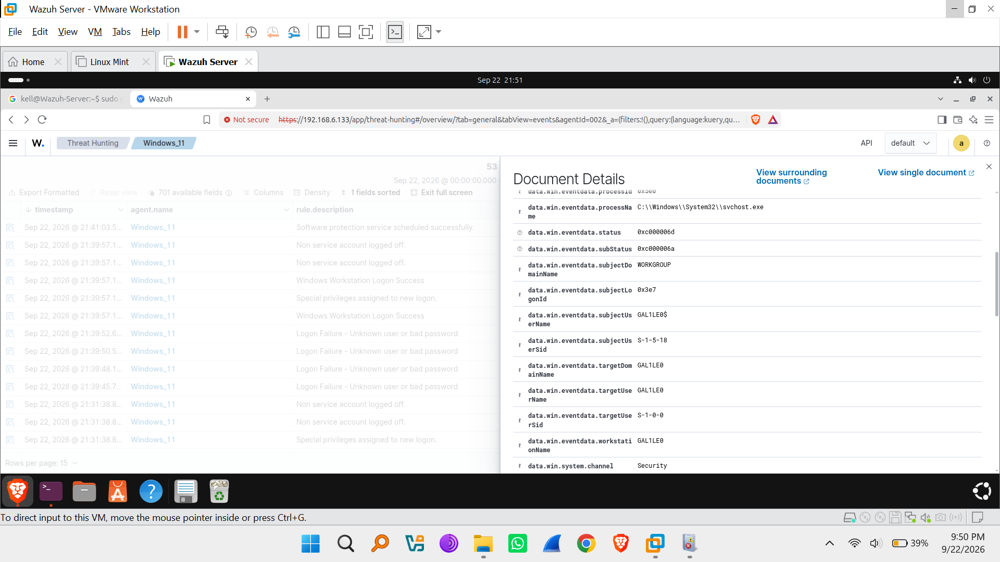

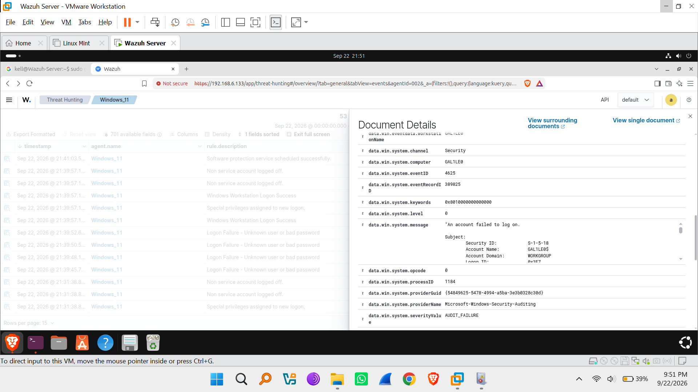

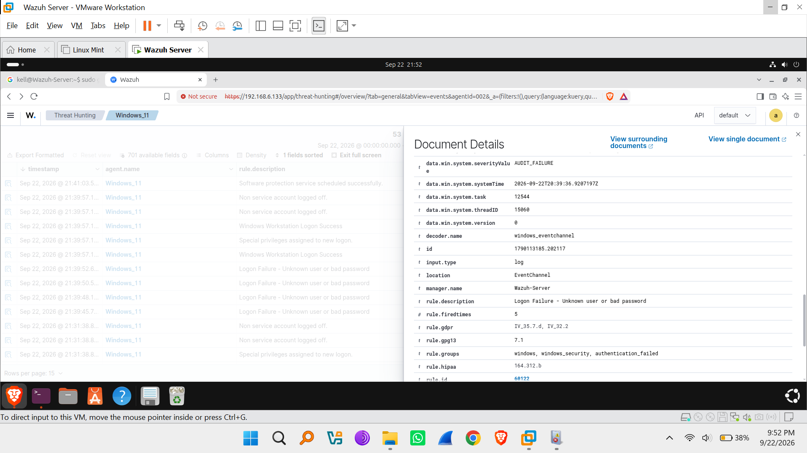

#### B. Successful Authentication & Special Privilege Assignments

- **Simulation Action:** Valid logon session established on the local terminal.
- **Ingested Telemetry & Verification:**
  - **Event Count:** 6 Authentication Success events recorded.
  - **Logon Success Rule:** Rule ID `60118` (Windows Workstation Logon Success, Level 3).
  - **Privilege Assignment Rule:** Rule ID `67028` (Special privileges assigned to new logon, Level 3).
  - **User Logoff Rule:** Rule ID `67023` (Non service account logged off, Level 3).


---

### 3.2 Activity Category 2: Process Execution & System Service Changes

- **Simulation Actions:** Triggering background service status changes, software protection scheduled tasks, and verifying agent startup execution.
- **Ingested Telemetry & Verification:**
  - **Agent Startup Event:** Rule ID `503` (Wazuh agent started, Level 3).
  - **System Service Startup:** Rule ID `60668` (The Windows search service started, Level 3).
  - **Scheduled Service Execution:** Rule ID `60642` (Software protection service scheduled successfully, Level 3).
  - **Report Signature Summaries:** Rule ID `60608` (Summary event of the report's signatures, Level 4).
  - **Audit Failure Events:** Rule ID `60104` (Windows audit failure event, Level 5).

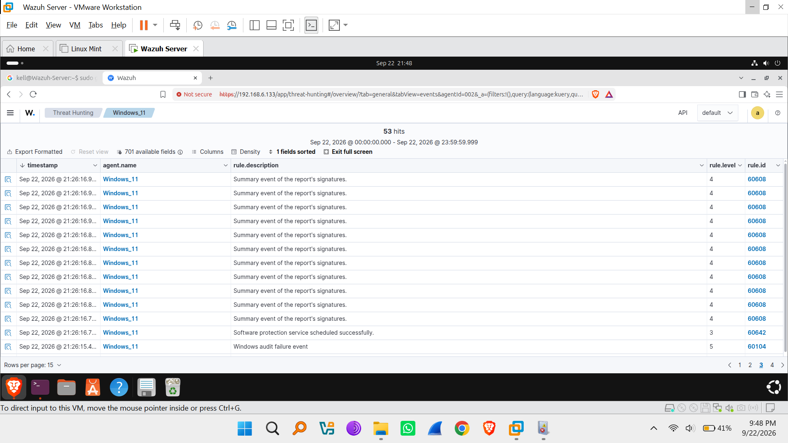

---

### 3.3 Activity Category 3: Account Creation & Manipulation (Persistence Testing)

- **Simulation Action:** Created a test local account via Administrative Command Prompt on target GAL1LEO:

```cmd
net user FakeTestAccount /add
```

- **Ingested Telemetry & Verification:**
  - **Windows Event ID:** `4720` (A user account was created).
  - **Primary Alert Rule:** Rule ID `60109` (User account enabled or created, Level 8 - High).
  - **Correlated Chain Rules:**
    - Rule ID `60110` (User account changed, Level 8).
    - Rule ID `60170` & `60160` (Users Group / Domain Users Group Changed, Level 5).
  - **Target User Created (`targetUserName`):** FakeTestAccount.
  - **Subject Creating User (`subjectUserName`):** GAL1LEO$ / Local Administrator.
  - **MITRE ATT&CK Mapping:** T1098 (Account Manipulation / Persistence).


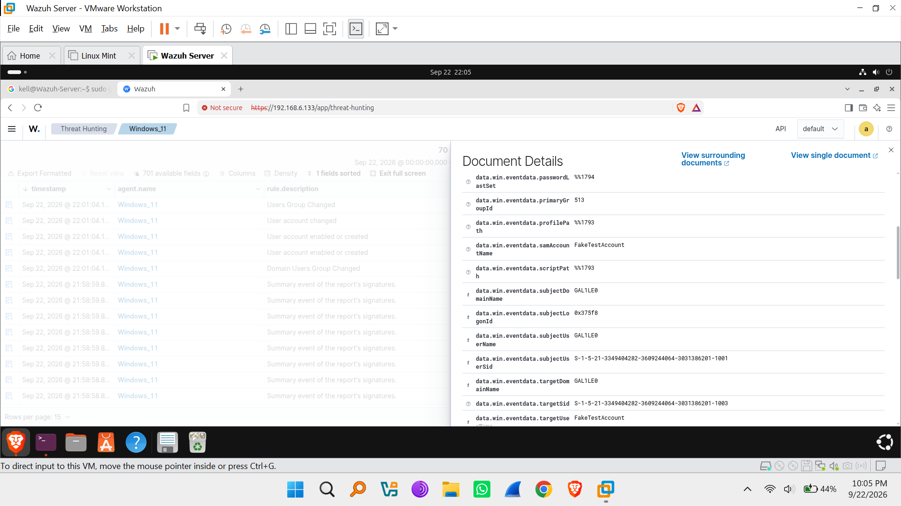

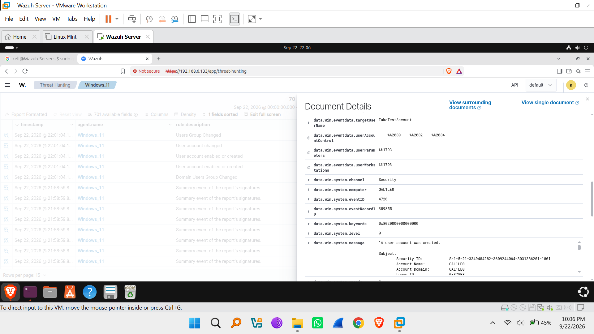

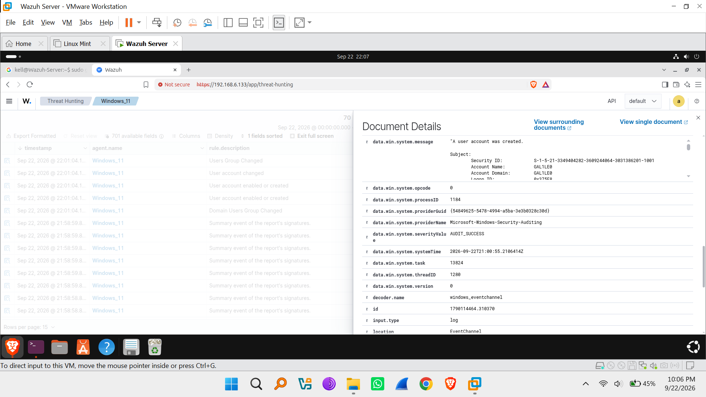

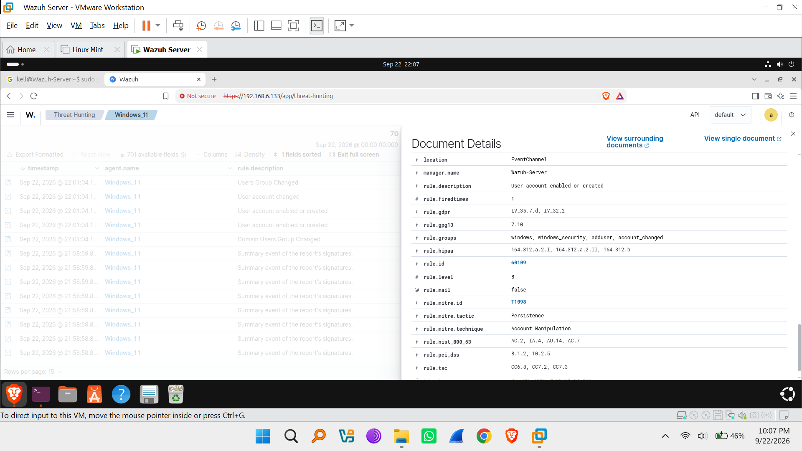


---

## 4. Telemetry Breakdown Table

The following summary table maps the simulated activities to the telemetry fields collected in Wazuh SIEM:

| Event Description | Rule ID | Level | Event ID / Channel | Source Host (agent.name / Host) | Key Field Ingested |
|---|---|---|---|---|---|
| Agent Startup | 503 | 3 | Internal Agent | Windows_11 / GAL1LEO | Agent process active |
| Workstation Logon Success | 60118 | 3 | 4624 / Security | Windows_11 / GAL1LEO | logonType: 2 |
| Logon Failure (Bad Password) | 60122 | 5 | 4625 / Security | Windows_11 / GAL1LEO | targetUserName: GAL1LEO |
| Search Service Started | 60668 | 3 | System | Windows_11 / GAL1LEO | Windows Search Service |
| Software Protection Task | 60642 | 3 | System | Windows_11 / GAL1LEO | Scheduled Task Execution |
| User Account Creation | 60109 | 8 | 4720 / Security | Windows_11 / GAL1LEO | targetUserName: FakeTestAccount |

---

## 5. Conclusion & Operational Impact

1. **Successful Activity Simulation:** All permitted endpoint activities — authentication attempts, process executions, service state notifications, and administrative account creations — were executed safely on the target machine.
2. **Telemetry Ingestion Confirmed:** The Wazuh SIEM Manager (192.168.6.133) successfully captured, parsed, decoded, and categorized 53 log events in real time.
3. **Endpoint Source Attributed:** Host identification metadata confirmed that all activity originated from target machine GAL1LEO (Agent Name: Windows_11, Agent ID: 002, IP: 192.168.6.1).
